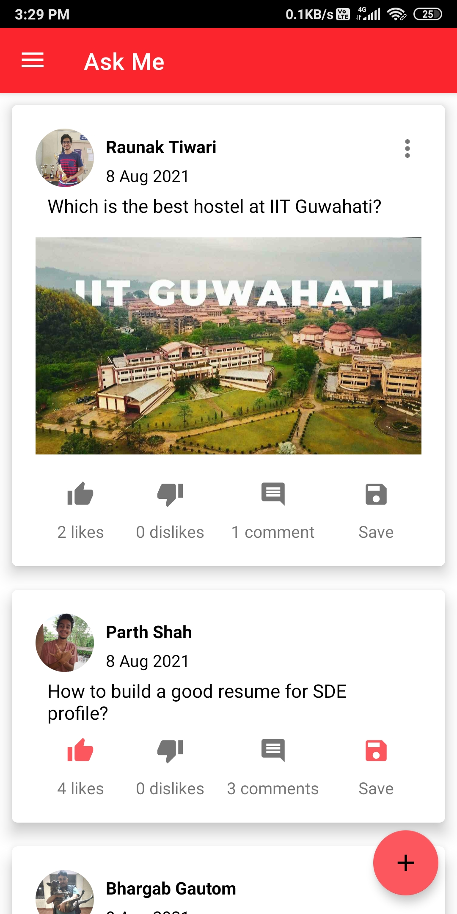
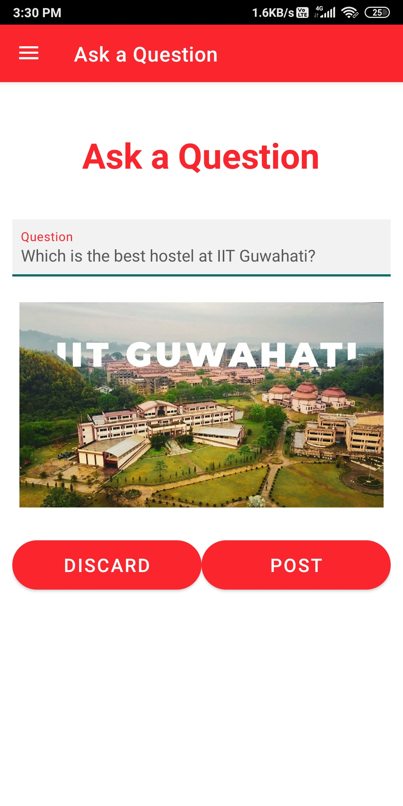
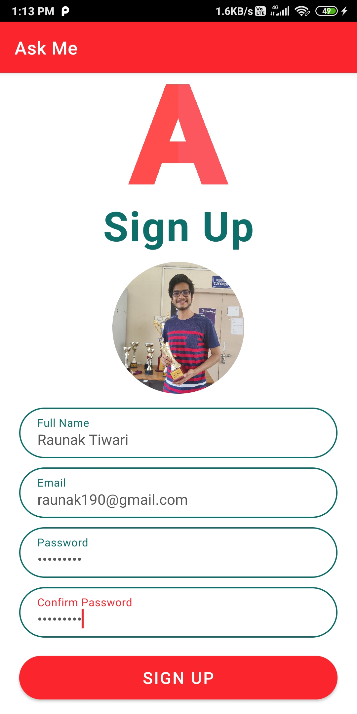
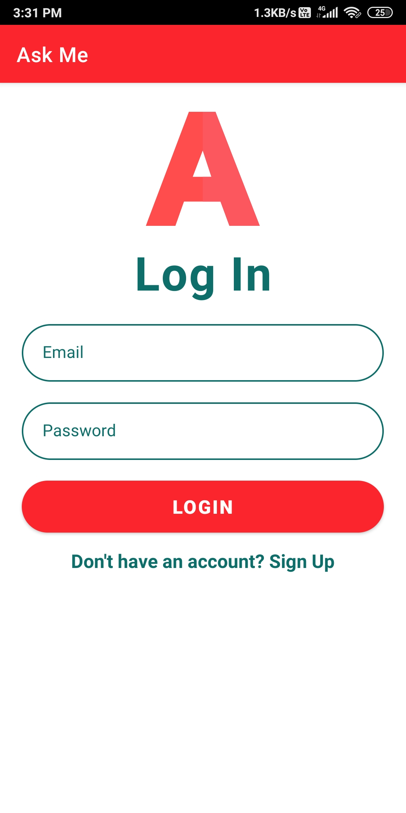

# AskMe-App
This is a social media app, where user can post their question, answer others question, like, dislike and save the posts.

# Screenshots

<table><tr><td>
  
  </td>
  <td style="background-color:#FF0000">
  
</td></tr>

<tr><td>
  
  </td>
  <td>
    
</td></tr>
<tr><td>  
    
</td></tr>
</table>
